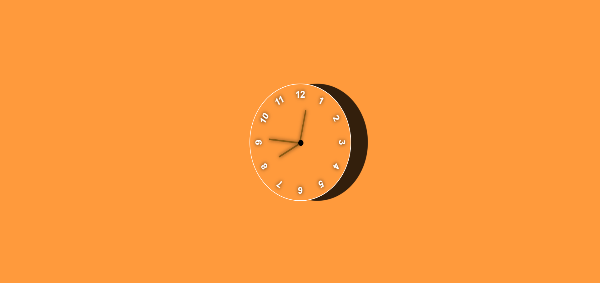

# Analog Clock

Simple, elegant analog clock built with HTML, CSS and JavaScript.

> Analog Clock Built Using HTML, CSS and JavaScript.

## Features

- Clean, minimal design powered by CSS for styling and JS for time updates
- Smooth second, minute and hour hands
- Small, dependency-free codebase (index.html, style.css, script.js)
- Works in any modern browser

## Files

- `index.html` — markup for the clock
- `style.css` — styling and layout
- `script.js` — logic that updates the clock hands every second
- `Screenshot 2024-10-13 200258.png` — demo screenshot used above

## Quick start

1. Clone this repository:

   git clone https://github.com/BinaryVortex/Analog-Clock-4.git

2. Open `index.html` in your browser (double-click the file or serve the directory):

   - Local file: open `index.html` directly
   - Simple server: `python -m http.server 8000` then open `http://localhost:8000`

## Customization

- Colors and sizes are defined in `style.css`. Edit the CSS to change the clock face, hand colors, or overall size.
- To change behavior (e.g., smooth motion vs stepped seconds), edit the update logic in `script.js`.

## Contributing

Contributions, issues and feature requests are welcome. Feel free to:

- Open an issue to report bugs or suggest features
- Submit a pull request with improvements or fixes

## Notes

No external libraries are required — this is plain HTML/CSS/JS. If you want to publish a live demo, enable GitHub Pages in the repository settings and point it to the `main` branch.

## License

No license specified. If you want to make this project open-source, consider adding an `LICENSE` file (MIT is a common choice).
